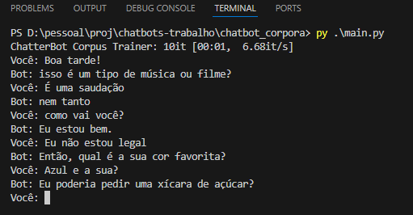

# Exercício 2: Chatbot treinado com Corpora

Este projeto utiliza a biblioteca `ChatterBot` para criar um chatbot de conversação geral. Diferente do bot de FAQ, este foi treinado utilizando o corpus de diálogos em português (`chatterbot.corpus.portuguese`), que fornece uma base de conhecimento mais ampla e genérica.

## Dependências

As dependências do projeto:

ChatterBot==1.0.5
chatterbot-corpus==1.2.0
spacy==2.3.9
SQLAlchemy<2.0.0,>=1.4.0

Assim como no primeiro exercício, o modelo de linguagem `spaCy` para o português é necessário

## Execução

Para interagir com o chatbot, execute o script principal:

python main.py

O treinamento pode levar um momento na primeira execução, pois o bot processará todo o corpus. Após o treinamento, você poderá conversar com ele. Para encerrar, digite `sair`.

## Demonstração

