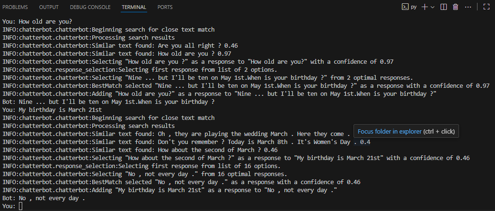

# Exercício 3: Chatbot treinado com Dataset Externo

Este chatbot foi desenvolvido com `ChatterBot` e treinado utilizando um dataset público da plataforma Hugging Face: o **`daily_dialog`**. Este dataset contém milhares de diálogos cotidianos em inglês, o que permite ao bot aprender uma gama mais ampla de interações de conversação.

**Nota:** Como o treinamento foi feito com dados em inglês, a interação com este chatbot deve ser realizada em inglês para obter respostas coerentes.

## Dependências

As bibliotecas necessárias, incluindo a `datasets`:

ChatterBot==1.0.5
datasets==2.16.1
spacy==2.3.9
SQLAlchemy<2.0.0,>=1.4.0

## Execução

Execute o script `main.py` para iniciar o bot. O download do dataset e o treinamento podem levar vários minutos na primeira vez.

py main.py

Após o treinamento, interaja com o bot em **inglês**. Para sair, digite `exit`.

## Demonstração

