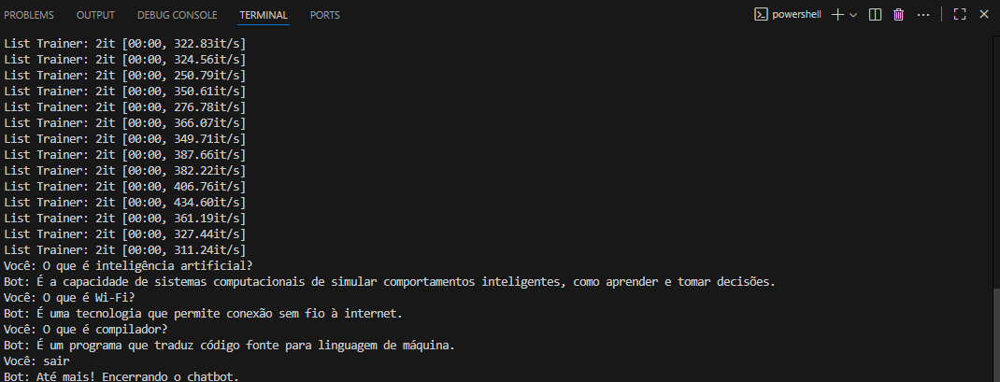
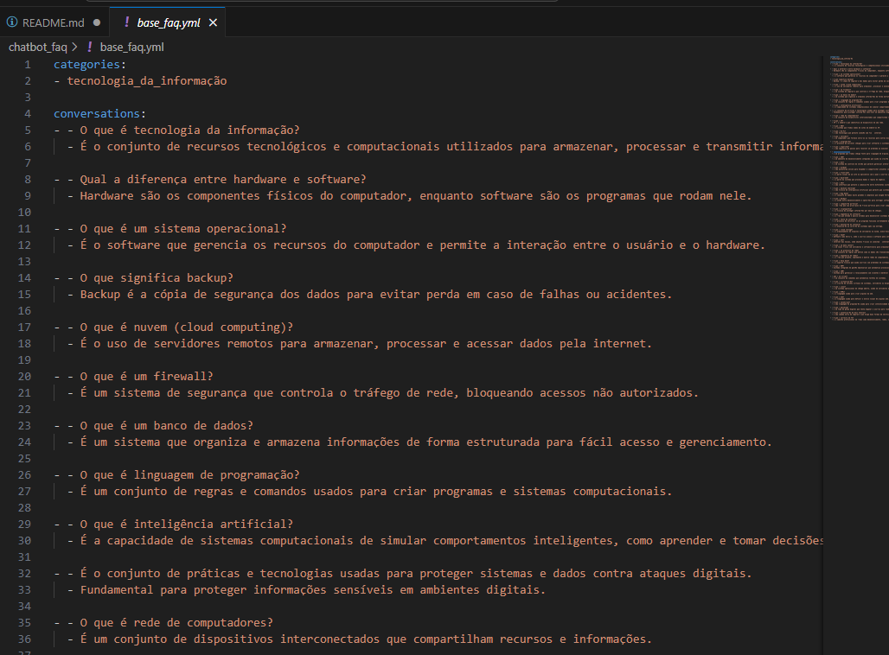

# Exercício 1: Chatbot de FAQ

Este projeto implementa um chatbot simples utilizando a biblioteca `ChatterBot`. O objetivo deste bot é funcionar como um sistema de Perguntas Frequentes (FAQ) sobre um tema específico. Ele foi treinado com uma lista pré-definida de 50 ou mais pares de perguntas e respostas.

## Dependências

As bibliotecas necessárias para executar este projeto:

ChatterBot==1.0.5
spacy==2.3.9
SQLAlchemy<2.0.0,>=1.4.0

Além disso, o `ChatterBot` utiliza o `spaCy` para processamento de linguagem. É necessário baixar o modelo para o 

## Execução

Para iniciar o chatbot, execute o script `main.py` a partir do terminal:

python main.py

O bot saudará você e estará pronto para responder às perguntas presentes em sua base de conhecimento. Para encerrar a conversa, digite `sair`.

## Demonstração

