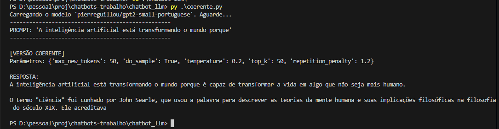
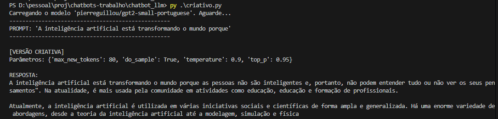

# chatbots
Testes de chatbot
# Exercício 4: Experimento com LLM

Este exercício explora o poder de um Modelo de Linguagem Grande (LLM) para gerar texto. Utilizamos o modelo `gpt2-small-portuguese` da biblioteca `transformers` para criar duas versões de respostas para o mesmo prompt:

1.  **Versão Coerente (`coerente.py`):** Gera uma resposta mais curta, focada e previsível.
2.  **Versão Criativa (`criativo.py`):** Gera uma resposta mais longa, aberta e original.

O objetivo é demonstrar como os parâmetros de geração de texto controlam o comportamento do modelo.

## Dependências

Dependências (`torch` e `transformers`):

pip install torch
pip install transformers

## Execução

Existem dois scripts separados, um para cada versão da resposta.

**Para gerar a resposta coerente:**

python coerente.py

**Para gerar a resposta criativa:**

python criativo.py

## Análise dos Parâmetros

A principal diferença entre os dois scripts está nos parâmetros passados para a função de geração do modelo.

### Versão Coerente

Neste script, buscamos previsibilidade e concisão.

* **`"temperature": 0.3`**: Uma temperatura baixa reduz a aleatoriedade, fazendo o modelo escolher as palavras mais prováveis e lógicas, evitando desvios criativos.
* **`"max_new_tokens": 40`**: Limitamos o tamanho da resposta para mantê-la direta.
* **`"repetition_penalty": 1.2`**: Adicionamos uma penalidade para evitar que o modelo entre em loops e repita a mesma frase, um efeito colateral comum de temperaturas muito baixas.

### Versão Criativa

Aqui, o objetivo era incentivar a originalidade e a exploração de ideias.

* **`"temperature": 0.9`**: Uma temperatura alta aumenta a aleatoriedade, permitindo que o modelo escolha palavras menos óbvias e crie associações mais surpreendentes.
* **`"max_new_tokens": 80`**: Damos mais espaço para o modelo desenvolver suas ideias.
* **`"top_p": 0.95`**: Usamos *nucleus sampling* para considerar um leque maior de palavras possíveis, mantendo um núcleo de coerência e descartando as opções mais absurdas.

## Demonstração

#### Resposta Coerente

#### Resposta Criativa
